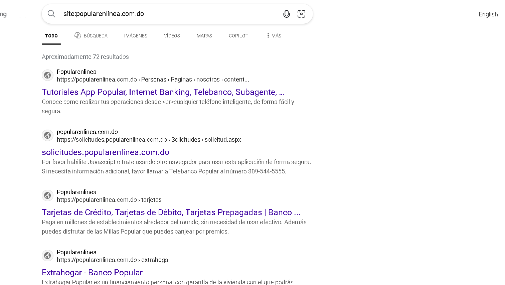
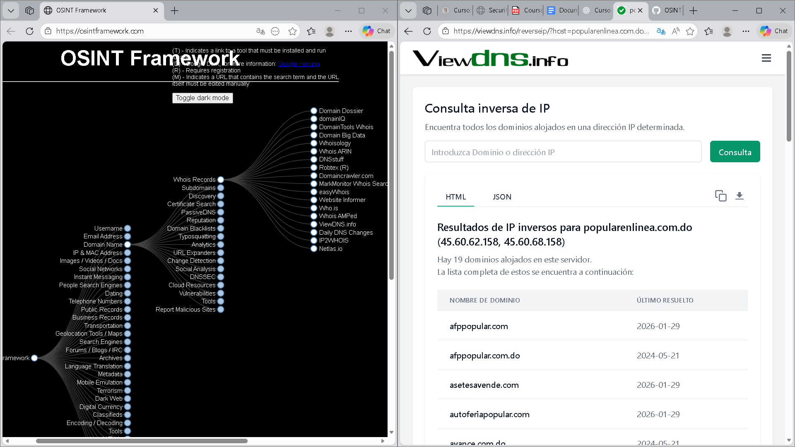
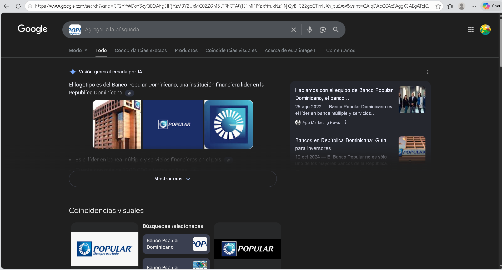
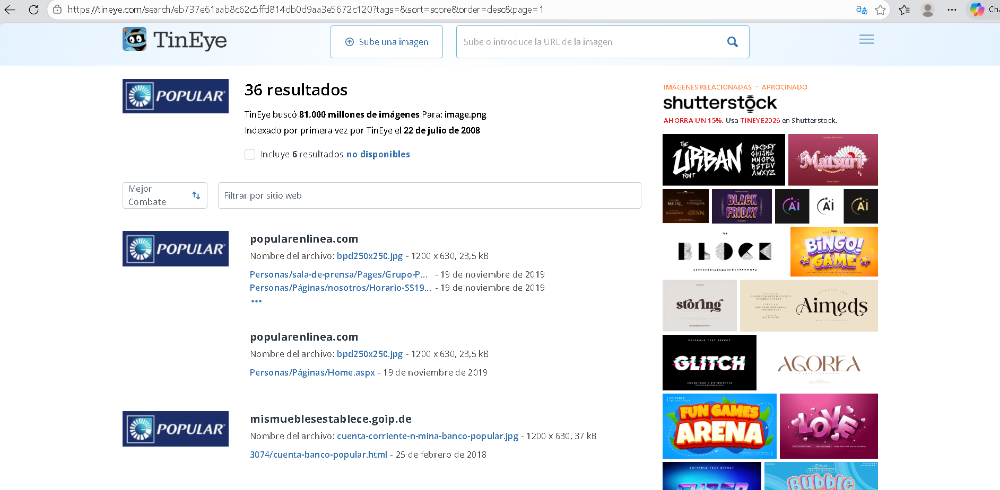
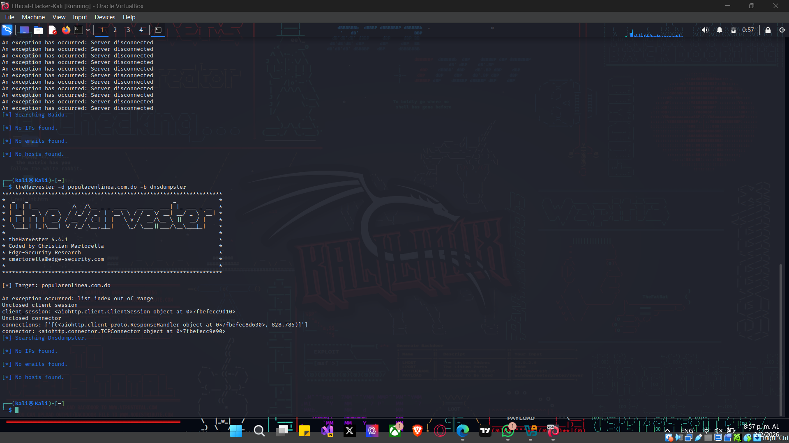

# OSINT-Self-Investigation

## Google Dorks – Banco Popular Dominicano

Se utilizaron operadores avanzados de Google para identificar información pública indexada relacionada con el Banco Popular Dominicano, incluyendo dominios, documentos y presencia en redes profesionales.

## OSINT Framework – Banco Popular Dominicano

Se utilizó una herramienta del OSINT Framework para analizar información pública del dominio del Banco Popular Dominicano, demostrando el uso de fuentes abiertas para la recopilación de datos.

## Google Image Search – Banco Popular Dominicano

Se utilizó la búsqueda inversa de imágenes de Google para identificar el uso público del logotipo del Banco Popular Dominicano en la web.

## TinyEye – Banco Popular Dominicano

Se utilizó TinyEye para verificar si el logotipo del Banco Popular Dominicano ha sido reutilizado en otros sitios web mediante búsqueda inversa de imágenes.

## TheHarvester – Banco Popular Dominicano

Se ejecutó la herramienta TheHarvester en el sistema operativo Kali Linux para analizar dominios asociados al Banco Popular Dominicano utilizando múltiples fuentes OSINT. No se identificaron correos electrónicos, subdominios ni hosts expuestos públicamente, lo cual es consistente con una institución financiera que mantiene una fuerte postura de seguridad y reduce significativamente su huella de información en fuentes abiertas.
